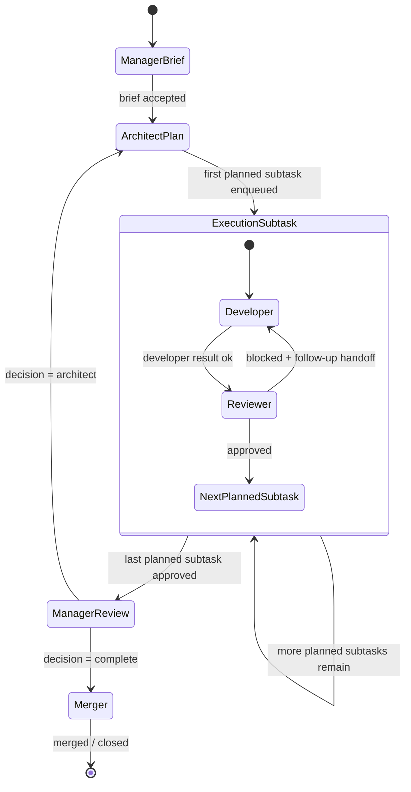
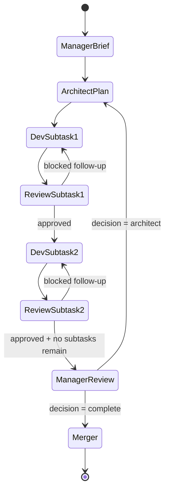

# Initiative Phase Model (Draft)

This document describes a proposed higher-level orchestration model for `agentrunner` that introduces **Manager** and **Architect** as **phase roles**, rather than treating them as mandatory participants in every tiny execution loop.

The goal is to keep the system lean while making planning, decomposition, and bundle-level closure more explicit and deterministic.

## Why this model exists

The current `agentrunner` proofs have exercised a strong execution spine:
- Developer
- Reviewer
- Merger

That execution loop is now reasonably proven for bounded work, including:
- normal implementation/review/merge flow
- follow-up Developer insertion after blocked review
- ff-only merge success
- blocked non-fast-forward merge
- Developer passback/rebase recovery
- recovery loop closure
- a bounded self-hosting real task on `agentrunner`

What is still missing is a stronger model for:
- how higher-level objectives are defined
- how those objectives become executable subtasks
- when the system should escalate back to redesign or closure review

This document proposes a phase-oriented model for that layer.

---

# Core principle

## Manager and Architect are not execution-loop roles by default

Instead:
- **Manager** operates at the **initiative/bundle** level
- **Architect** operates at the **design/decomposition** level
- **Developer / Reviewer** dominate the **execution** phase
- **Merger** closes an initiative only after bundle-level completion has been affirmed

This avoids turning every small task into a committee meeting.

---

# Phase model

## 1) Design phase

### Manager
Manager defines the initiative at a high level:
- objective
- desired outcomes
- constraints
- definition of done
- priority / scope boundary

Manager is responsible for saying:
> what are we trying to achieve, and what counts as enough?

### Architect
Architect refines the Manager brief into an executable plan:
- approach
- tradeoffs
- subtask decomposition
- task ordering
- risks / review focus

Architect is responsible for saying:
> given those goals, what is the smallest sane plan and how should it be broken down?

## Important design rule
In the first-cut model, **Architect is not optional during design**.

Reason:
If Manager only emits high-level intent and the system skips Architect, there is a gap between:
- strategic goals
- executable Developer/Reviewer subtasks

That gap is where ambiguity and informal operator interpretation creep back in.

So, for this model:
- Manager brief -> Architect plan
- always

---

## 2) Execution phase

Developer and Reviewer operate on **Architect-defined subtasks**, not directly on the entire initiative brief.

This phase may contain:
- one subtask
- or multiple subtask cycles in sequence

The expectation is that once the design phase has produced a good enough plan, the system should be able to execute multiple Dev/Reviewer cycles before needing higher-level intervention again.

This is the main reason to keep Manager/Architect out of the middle of most task execution.

---

## 3) Outcome review phase

### Manager re-enters
Manager returns after the planned execution slice is complete.

Manager is not doing code review here.
Manager is deciding whether the **initiative-level goals** were satisfied.

This means Manager should answer something like:
- did we get the outcomes we wanted?
- is this initiative complete enough to close?
- or do we need another design pass?

## Important closure rule
Manager output at this stage should be **narrow and deterministic**.

Rather than freeform routing like:
- `nextAction=merge`
- `nextAction=developer`
- `nextAction=reviewer`
- `nextAction=architect`

…the Manager should ideally emit a constrained bundle-level decision, such as:
- `decision: complete`
- `decision: architect`

The **system** should own the next transition from there.

This keeps Manager from becoming an arbitrary traffic cop.

---

## 4) Redesign / refactor phase

Architect only re-enters when needed.

Typical triggers:
- implementation is not working in practice
- the original task decomposition was wrong
- assumptions broke under real execution
- a redesign / refactor / rethink is required

Architect is **not** meant to hover over every normal review outcome.
Architect is a higher-level re-planning role.

---

## 5) Closure phase

If Manager decides `complete`, the system should enqueue **Merger**.

Merger remains constrained by the same mechanics/proof rules already established:
- explicit approval evidence
- explicit merge policy
- read-only mergeability checks before merge
- ff-only merge as an actual side effect, not a harmless check

---

# Role boundaries

## Manager
### When Manager appears
- at initiative start
- at initiative end
- at major scope-change / redesign points

### What Manager should not do
- define low-level file-by-file implementation details
- perform code review
- act as a freeform role router for every minor event

## Architect
### When Architect appears
- immediately after Manager brief
- again only when redesign/replanning is needed

### What Architect should not do
- implement features
- merge code
- micromanage every tiny follow-up fix

## Developer / Reviewer
### When they appear
- throughout the main execution body
- possibly multiple cycles in a row

### Why they dominate execution
Execution should continue at the **lowest competent level**.
Higher-level roles should only re-enter when initiative-level direction or redesign is needed.

## Merger
### When Merger appears
- only after execution is complete enough to close
- only after Manager has affirmed initiative-level completion

---

# Proposed state model

This model implies two conceptual levels of state:

## 1) Initiative-level state
Owned conceptually by Manager/Architect:
- initiative id
- objective
- definition of done
- current phase
- plan reference
- completed/pending subtasks
- final decision state

## 2) Execution-level state
Owned by Developer/Reviewer/Merger:
- queue items
- result artifacts
- handoff artifacts
- tick log
- branch / merge status

The existing queue/tick/result model already covers much of execution-level state.
The new work is to define initiative-level artifacts and transitions clearly.

---

# Mermaid state diagram



---

# Additional artifact/transition view

The state diagram above is phase-oriented.
The system also needs a more explicit artifact/transition contract, which will be defined in a later section/chunk.

At a high level:
- Manager emits a **brief artifact**
- Architect emits a **plan artifact**
- Developer emits a **result artifact**
- Reviewer emits a **result artifact** and optionally a **handoff artifact**
- Manager later emits a **closure decision artifact**
- Merger emits a **merge result artifact**

These artifacts should drive system transitions deterministically.

---

# Proposed MVP implementation stance

Do **not** implement the entire cathedral at once.

The first-cut version should be deliberately small:
1. define the role artifacts
2. define the transition table
3. add the minimal initiative-level state needed to walk a planned subtask list
4. keep the existing execution mechanics wherever possible

This means the next design chunk should specify:
- Manager brief artifact shape
- Architect plan artifact shape
- Manager closure decision shape
- transition rules owned by mechanics

---

# First experiment target for this model

A good first initiative for testing this phase model is still:
- **compact status/audit helper for `agentrunner`**

Why it fits:
- useful but bounded
- enough ambiguity for Architect to contribute
- enough initiative-level judgment for Manager to matter
- small enough to avoid creating a giant planning bureaucracy

This should likely be tested as:
- one Manager brief
- one Architect plan
- 2–3 subtasks max
- Manager closure decision
- Merger

That is enough to test the phase model without turning it into a fake enterprise org chart.

---

# Chunk 2: artifact contracts + transition table

This section makes the phase model concrete enough to implement.

The aim is not to fully replace existing Developer / Reviewer / Merger result contracts.
Instead, it defines the additional initiative-level artifacts and transition rules needed to let Manager and Architect participate deterministically.

## Design goals for initiative artifacts

Initiative-level artifacts should be:
- small
- explicit
- deterministic
- easy for mechanics to inspect
- separate from normal Developer/Reviewer/Merger execution artifacts

They should answer:
- what are we trying to achieve?
- how has it been decomposed?
- what phase are we currently in?
- what should happen next?

---

# Proposed initiative-level artifacts

## 1) Manager brief artifact

The Manager brief is the initiative kickoff artifact.
It defines the high-level objective and the boundary of success.

### Required fields
- `initiativeId` — stable string identifier
- `title` — short human-readable title
- `objective` — non-empty string
- `desiredOutcomes` — list of strings
- `constraints` — object
- `definitionOfDone` — list of strings
- `priority` — string (for example `low|normal|high`)
- `writtenAt` — ISO-8601 timestamp string

### Optional fields
- `notes`
- `risks`
- `project`
- `repoPath`
- `baseBranch`
- `suggestedBranch`
- `maxSubtasks`

### Minimal example
```json
{
  "initiativeId": "agentrunner-status-helper",
  "title": "Compact project status helper",
  "objective": "Give operators a compact way to inspect a project runtime state dir.",
  "desiredOutcomes": [
    "Show whether a run is active",
    "Show current queue head or queue size",
    "Show last completed item and last tick summary"
  ],
  "constraints": {
    "keepItSmall": true,
    "noHeavyDependencies": true
  },
  "definitionOfDone": [
    "Helper works on existing state dirs",
    "Output is concise and useful",
    "Docs mention basic usage"
  ],
  "priority": "normal",
  "writtenAt": "2026-04-10T14:45:00+10:00"
}
```

### System response
When a Manager brief is accepted:
- mechanics records it as the active initiative brief
- mechanics enqueues **Architect** next
- execution does **not** start directly from the Manager brief

This keeps the Manager->Architect design handoff mandatory.

---

## 2) Architect plan artifact

The Architect plan turns the Manager brief into executable subtasks.

### Required fields
- `initiativeId`
- `approachSummary` — non-empty string
- `tradeoffs` — list of strings
- `subtasks` — non-empty list
- `reviewFocus` — list of strings
- `writtenAt` — ISO-8601 timestamp string

### Suggested subtask fields
Each subtask should be concrete enough to enqueue directly.

Required:
- `subtaskId`
- `title`
- `goal`
- `role` (initially usually `developer`)
- `files` — list of likely touched files
- `checks` — list of checks to run

Optional:
- `constraints`
- `contextFiles`
- `notes`
- `branch`
- `base`

### Minimal example
```json
{
  "initiativeId": "agentrunner-status-helper",
  "approachSummary": "Add one small script that reads existing runtime files and prints a concise summary without introducing dependencies.",
  "tradeoffs": [
    "Prefer plain text over fancy formatting",
    "Read append-only logs lightly; avoid building a dashboard"
  ],
  "subtasks": [
    {
      "subtaskId": "status-helper-1",
      "title": "Add helper script",
      "goal": "Create a small CLI helper that prints a compact project state snapshot.",
      "role": "developer",
      "files": ["agentrunner/scripts/status_audit.py"],
      "checks": ["python3 -m py_compile agentrunner/scripts/status_audit.py"]
    },
    {
      "subtaskId": "status-helper-2",
      "title": "Document helper usage",
      "goal": "Add a short usage note for the helper.",
      "role": "developer",
      "files": ["README.md"],
      "checks": ["rg -n \"status_audit\" README.md"]
    }
  ],
  "reviewFocus": [
    "output remains compact",
    "no dependency sprawl",
    "fields shown are actually useful to operators"
  ],
  "writtenAt": "2026-04-10T14:50:00+10:00"
}
```

### System response
When an Architect plan is accepted:
- mechanics stores the plan as the active initiative plan
- mechanics initializes initiative execution state
- mechanics enqueues the **first planned subtask**, not the whole plan blindly

This keeps the queue advancing one step at a time while still letting the plan cover multiple subtasks.

---

## 3) Manager closure decision artifact

This is the bundle-level outcome judgment after the planned subtasks have completed.

### Important rule
Manager decision should be **narrow** and **deterministic**.

In the first-cut model, the allowed decisions should be:
- `complete`
- `architect`

Where:
- `complete` means the initiative is complete enough to proceed to closure
- `architect` means the initiative needs redesign/replanning

### Required fields
- `initiativeId`
- `decision` — `complete|architect`
- `reason` — non-empty string
- `writtenAt` — ISO-8601 timestamp string

### Optional fields
- `notes`
- `remainingConcerns`
- `outcomesMet` — list of strings
- `outcomesMissed` — list of strings

### Minimal example
```json
{
  "initiativeId": "agentrunner-status-helper",
  "decision": "complete",
  "reason": "The helper satisfies the operator need and remains appropriately bounded.",
  "writtenAt": "2026-04-10T15:10:00+10:00"
}
```

### System response
- if `decision=complete` -> mechanics enqueues **Merger**
- if `decision=architect` -> mechanics enqueues **Architect** for redesign/replanning

This preserves determinism and avoids making Manager an arbitrary freeform role router.

---

# Initiative execution state model

The current runtime state already tracks:
- current run
- queue
- last completed item
- extra-dev-turn policy/counters

The phase model needs an additional initiative-level state record.

## Proposed shape
This can live either inside `state.json` or as a separate `initiative.json`.
For the MVP, embedding under `state.initiative` is probably simplest.

### Pointer contract
`state.initiative` should be treated as the **active initiative pointer**, not as the full durable initiative history.
Its job is to answer, at a glance:
- which initiative is currently active
- which phase that initiative is in
- where the richer initiative-local state lives

That means the pointer should follow this closure contract:
- **successful closure** (`merged` / cleanly finished initiative): clear `state.initiative` so operators can immediately tell there is no active initiative
- **blocked or error closure**: `state.initiative` may be retained temporarily so recovery tooling and operator surfaces still point at the initiative that needs attention
- retained pointer state after blocked/error closure should be interpreted as **recovery/context visibility**, not as proof that useful execution is still progressing

Put differently: a present `state.initiative` means “this is the initiative operators should look at now”, while an absent `state.initiative` means “no initiative is currently active.”

### Proposed fields
```json
{
  "initiative": {
    "initiativeId": "agentrunner-status-helper",
    "phase": "execution",
    "managerBriefPath": "...",
    "architectPlanPath": "...",
    "managerDecisionPath": null,
    "currentSubtaskId": "status-helper-1",
    "completedSubtasks": [],
    "pendingSubtasks": [
      "status-helper-1",
      "status-helper-2"
    ],
    "branch": "feature/agentrunner/status-helper",
    "base": "master"
  }
}
```

### Phase values
Suggested initial set:
- `design-manager`
- `design-architect`
- `execution`
- `review-manager`
- `replan-architect`
- `closure-merger`
- `closed`

The exact enum can evolve, but it should remain small.

---

# Mapping subtasks to queue items

Architect subtasks should not be a completely separate execution model.
They should compile down into normal queue items wherever possible.

## Subtask -> queue item compilation
A planned subtask should become a normal queue item with additional initiative metadata, e.g.:

```json
{
  "id": "agentrunner-status-helper-1",
  "project": "agentrunner",
  "role": "developer",
  "goal": "Create a small CLI helper that prints a compact state snapshot.",
  "branch": "feature/agentrunner/status-helper",
  "base": "master",
  "checks": ["python3 -m py_compile agentrunner/scripts/status_audit.py"],
  "contextFiles": ["agentrunner/scripts/status_audit.py"],
  "initiative": {
    "initiativeId": "agentrunner-status-helper",
    "subtaskId": "status-helper-1"
  }
}
```

This keeps the mechanics engine mostly reusing the existing queue/result/tick path.

---

# Transition table (MVP)

## Design start
### Trigger
Manager brief artifact accepted

### Mechanics action
- store Manager brief path
- set `initiative.phase = design-architect`
- enqueue Architect item

---

## Architect complete
### Trigger
Architect plan artifact accepted

### Mechanics action
- store Architect plan path
- initialize `pendingSubtasks`
- set `initiative.phase = execution`
- enqueue first planned subtask only

---

## Developer complete on subtask
### Trigger
Developer result artifact `status=ok`

### Mechanics action
- mark subtask execution as ready for review
- enqueue Reviewer for the same subtask

This keeps Developer->Reviewer behavior aligned with the current proven execution spine.

---

## Reviewer blocked on subtask
### Trigger
Reviewer result `approved=false` and valid handoff artifact exists

### Mechanics action
- use the existing follow-up Developer insertion path
- preserve initiative/subtask metadata on generated follow-up item
- remain in `initiative.phase = execution`

This is intentionally reusing the already-proven follow-up mechanics.

---

## Reviewer approved on subtask
### Trigger
Reviewer result `approved=true`, no follow-up requested

### Mechanics action
- mark current subtask complete
- if more planned subtasks remain:
  - enqueue next planned subtask
- else:
  - set `initiative.phase = review-manager`
  - enqueue Manager closure review

This is one of the most important phase-model transitions.

---

## Manager closure decision = complete
### Trigger
Manager closure decision artifact with `decision=complete`

### Mechanics action
- set `initiative.phase = closure-merger`
- enqueue Merger item
- pass approval/initiative references into the Merger queue item

---

## Manager closure decision = architect
### Trigger
Manager closure decision artifact with `decision=architect`

### Mechanics action
- set `initiative.phase = replan-architect`
- enqueue Architect item
- preserve prior brief/plan references so the redesign is contextualized

---

## Merger success
### Trigger
Merger result `merged=true`

### Mechanics action
- set `initiative.phase = closed`
- record final merge artifact path
- initiative ends

---

# What stays intentionally out of scope for MVP

To keep this implementable, the first cut should **not** try to solve:
- parallel subtasks
- multiple active initiatives per project at once
- sophisticated dependency graphs
- freeform Manager routing beyond `complete|architect`
- Architect skipping during design phase
- dynamic reprioritization of multiple initiatives

These can come later if the basic phase model proves itself useful.

---

# First implementation target

The first implementation target for this model should still be a tiny initiative bundle, likely:
- `agentrunner` compact status/audit helper

Why this remains the right first initiative:
- enough ambiguity for Architect to matter
- enough outcome judgment for Manager to matter
- small enough to keep the state model understandable
- naturally expressible as 2–3 subtasks

---

# Chunk 3: helper strategy, on-disk layout, and metadata propagation

This section answers the practical "how do these artifacts actually get produced and stored?" questions.

The aim is to keep the initiative phase model implementable without destabilizing the already-proven execution spine.

---

# Key implementation stance

## Do not overload the current result artifact too much

Developer / Reviewer / Merger already have a working result-artifact contract.
That contract is now proven enough that we should avoid stuffing initiative-specific structure into it haphazardly.

Instead, the cleaner first-cut approach is:
- keep normal execution results using the current `emit_result.py`
- introduce **dedicated initiative helpers** for initiative-level artifacts
- store those initiative artifacts in a dedicated area under project runtime state

This preserves a clean separation between:
- execution results (`results/<queueItemId>.json`)
- initiative planning/decision artifacts

---

# Proposed helper strategy

## Existing helpers remain unchanged for execution roles
Current helpers should continue to serve:
- Developer
- Reviewer
- Merger

That means:
- `emit_result.py` remains the execution result helper
- `emit_handoff.py` remains the follow-up handoff helper

These should not become a dumping ground for initiative-plan structure.

## New helpers for initiative-level roles
Introduce dedicated helpers for the new initiative artifacts.

### Proposed helper set
- `emit_manager_brief.py`
- `emit_architect_plan.py`
- `emit_manager_decision.py`

These can be deliberately narrow and artifact-specific.

### Why dedicated helpers are preferable
- each helper can validate a small, role-specific shape
- prompts become clearer and less overloaded
- mechanics can key off file presence/path conventions cleanly
- execution artifacts stay familiar and stable

---

# Proposed on-disk layout

Current runtime state already uses:
- `state.json`
- `queue.json`
- `queue_events.ndjson`
- `ticks.ndjson`
- `results/`
- `handoffs/`
- `review_findings/`

The initiative model should add a dedicated subtree.

## Proposed layout
Under:
- `/home/openclaw/.agentrunner/projects/<project>/`

add:
- `initiatives/<initiativeId>/brief.json`
- `initiatives/<initiativeId>/plan.json`
- `initiatives/<initiativeId>/decision.json`
- `initiatives/<initiativeId>/state.json`

Optionally later:
- `initiatives/<initiativeId>/history.ndjson`

### Why this layout
It keeps initiative-level artifacts:
- grouped together
- isolated from normal execution results
- easy to inspect by humans
- easy to reference by mechanics

### Example
```text
/home/openclaw/.agentrunner/projects/agentrunner/
  state.json
  queue.json
  queue_events.ndjson
  ticks.ndjson
  results/
  handoffs/
  initiatives/
    agentrunner-status-helper/
      brief.json
      plan.json
      decision.json
      state.json
```

---

# Initiative state placement

## Recommendation
Use **both**:
- a lightweight initiative pointer in the main project `state.json`
- a fuller initiative state file under `initiatives/<initiativeId>/state.json`

### Why both are useful
#### Main `state.json`
Should answer quickly:
- is an initiative active?
- which initiative?
- what phase is it in?

This is useful for fast operational checks.

#### Initiative-local `state.json`
Should hold the richer phase-tracking details:
- current subtask
- pending/completed subtask ids
- artifact paths
- branch/base
- phase-specific notes

This keeps the main project state from becoming bloated.

### Proposed main-state pointer
```json
{
  "initiative": {
    "initiativeId": "agentrunner-status-helper",
    "phase": "execution",
    "statePath": "/home/openclaw/.agentrunner/projects/agentrunner/initiatives/agentrunner-status-helper/state.json"
  }
}
```

### Pointer lifecycle note
The main-state pointer is intentionally compact.
It exists so `state.json` can quickly answer “what is the active initiative right now?” without copying the whole initiative-local state blob.

Operationally:
- clear this pointer after successful initiative closure so stale initiative context does not linger in the main project state
- allow the pointer to remain after blocked/error closure when that helps recovery, debugging, or operator visibility
- if the pointer remains after blocked/error closure, operator surfaces should describe that as blocked/stale initiative context rather than implying normal active execution

### Proposed initiative-local state
```json
{
  "initiativeId": "agentrunner-status-helper",
  "phase": "execution",
  "managerBriefPath": ".../brief.json",
  "architectPlanPath": ".../plan.json",
  "managerDecisionPath": null,
  "currentSubtaskId": "status-helper-1",
  "completedSubtasks": [],
  "pendingSubtasks": ["status-helper-1", "status-helper-2"],
  "branch": "feature/agentrunner/status-helper",
  "base": "master"
}
```

---

# How queue items should carry initiative metadata

To preserve initiative context during execution, queue items compiled from Architect subtasks should include a compact initiative block.

## Recommended queue-item metadata
```json
{
  "initiative": {
    "initiativeId": "agentrunner-status-helper",
    "subtaskId": "status-helper-1",
    "managerBriefPath": ".../brief.json",
    "architectPlanPath": ".../plan.json"
  }
}
```

### Why this matters
This lets:
- Developer know which subtask is being executed
- Reviewer know which subtask is being reviewed
- mechanics correlate execution artifacts back to initiative phase state

This should remain compact and reference-based.
Do not inline the whole plan into every queue item.

---

# Preserving initiative metadata across follow-up insertion

This is one of the most important practical details.

The existing system already knows how to insert a follow-up Developer item after blocked review.
The initiative model must ensure that this generated item does not lose its bundle context.

## Rule
When mechanics inserts a follow-up Developer item due to Reviewer block:
- preserve the original queue item's `initiative` metadata
- preserve the original `branch` / `base`
- preserve the original `subtaskId`
- preserve Architect/Manager artifact references
- add the normal follow-up review artifacts (`sourceResultPath`, `handoffPath`, `reviewFindingsPath`) alongside that initiative block

### Resulting generated item shape (conceptual)
```json
{
  "id": "status-helper-1-followup",
  "role": "developer",
  "goal": "Address reviewer findings and re-run checks.",
  "branch": "feature/agentrunner/status-helper",
  "base": "master",
  "initiative": {
    "initiativeId": "agentrunner-status-helper",
    "subtaskId": "status-helper-1",
    "managerBriefPath": ".../brief.json",
    "architectPlanPath": ".../plan.json"
  },
  "origin": {
    "requestedBy": "agentrunner-r-123",
    "handoffPath": "...",
    "sourceResultPath": "...",
    "reviewFindingsPath": "..."
  }
}
```

### Why this is important
Without this, a blocked subtask would fall out of the initiative model and become just another floating follow-up task.
That would break the phase semantics.

---

# Manager / Architect queue-item patterns

Manager and Architect themselves should still run as normal queue items, but their artifact destinations should be initiative-local.

## Manager brief queue item
A Manager kickoff item should receive paths like:
- `INITIATIVE_BRIEF_PATH`
- maybe `INITIATIVE_STATE_PATH`

and should be prompted to write a Manager brief artifact there using `emit_manager_brief.py`.

## Architect plan queue item
An Architect planning item should receive:
- `INITIATIVE_BRIEF_PATH`
- `INITIATIVE_PLAN_PATH`
- `INITIATIVE_STATE_PATH`

and should be prompted to read the brief and write the plan using `emit_architect_plan.py`.

## Manager closure queue item
A Manager closure-review item should receive:
- `INITIATIVE_BRIEF_PATH`
- `INITIATIVE_PLAN_PATH`
- initiative execution summary references
- `INITIATIVE_DECISION_PATH`

and should write the closure decision using `emit_manager_decision.py`.

---

# Should initiative roles also write normal result artifacts?

## Recommendation: yes, but lightly
To remain compatible with the current mechanics model, Manager and Architect should still produce a normal result artifact via `emit_result.py`.

However, that result artifact should act mainly as:
- completion signal
- concise operator summary
- breadcrumb to the initiative artifact path

The real phase-driving content should live in the dedicated initiative artifact files.

### Why this hybrid approach is useful
It avoids forcing the current invoker/completion logic to special-case Manager/Architect too early.

So a Manager or Architect turn can:
1. write initiative artifact (`brief.json`, `plan.json`, `decision.json`)
2. write a normal result artifact summarizing completion and pointing to that file

That makes the current mechanics easier to extend incrementally.

---

# Proposed result summary pattern for initiative roles

## Architect result summary example
- `status: ok`
- `summary: Wrote initiative plan with 2 subtasks for agentrunner-status-helper.`
- `checks: []` or a small self-check list
- `operatorSummary`: concise note + subtask count

## Manager result summary example
- `status: ok`
- `summary: Wrote initiative brief for agentrunner-status-helper.`
- later: `summary: Marked initiative agentrunner-status-helper as complete.`

This keeps operator channels readable while the dedicated initiative artifacts hold the actual structure.

---

# MVP mechanics implication

This suggests a practical implementation path:

1. add new initiative helpers
2. add initiative-local artifact paths
3. add compact initiative metadata onto compiled execution queue items
4. preserve that metadata across follow-up Developer insertion
5. let Manager/Architect still finish via normal result artifacts for completion bookkeeping

That is enough to support the phase model without rewriting the current execution engine from scratch.

---

# Tradeoff note

An alternative would be to extend `emit_result.py` with Manager/Architect-specific fields and skip dedicated helpers.

This is possible, but less attractive for the first cut because it would:
- overload the existing result contract
- blur execution vs initiative artifacts
- make prompts harder to reason about

So the recommended first implementation remains:
- dedicated initiative artifact helpers
- normal result artifact still emitted as the completion signal

---

# Chunk 4: transition ownership + MVP implementation sequence

This section answers the last major structural question for a first implementation:

**where should the initiative-phase logic actually live?**

The main choice is:
- extend `invoker.py` to own everything
- or keep `invoker.py` focused on single-run mechanics and introduce a small initiative coordinator helper

## Recommendation
For MVP, use a **small initiative coordinator helper** rather than stuffing all phase logic into `invoker.py`.

---

# Why not put everything into `invoker.py`?

`invoker.py` already owns a lot of important low-level behavior:
- queue materialization
- dispatch via `/hooks/agent`
- result-file completion detection
- result/handoff validation
- follow-up Developer insertion
- operator summaries
- run lock/unlock state

That is the execution spine.
It is already proven enough that we should avoid turning it into a second scheduler plus a phase-engine plus a plan compiler all at once.

## If we overstuff `invoker.py`, risks include:
- mixing initiative-level reasoning with single-run completion logic
- making follow-up debugging much harder
- raising the blast radius of small phase-model bugs
- making future refactors painful

So the preferred split is:
- `invoker.py` stays primarily execution-oriented
- a new helper owns initiative-phase transitions and queue compilation

---

# Proposed mechanics split

## 1) `invoker.py` remains the execution engine
Responsibilities stay mostly as they are:
- dispatch one queue item
- detect completion via result file
- validate artifacts
- append ticks
- insert follow-up Developer work after blocked review
- update current/lastCompleted state

In other words:
**one queue item in, one result out**

## 2) new `initiative_coordinator.py` owns phase transitions
Responsibilities:
- inspect initiative-local artifacts/state
- enqueue Architect after Manager brief
- compile Architect subtasks into queue items
- advance from one planned subtask to the next after approved review
- enqueue Manager closure review after final approved subtask
- enqueue Merger after Manager `decision=complete`
- enqueue Architect again after Manager `decision=architect`

This is the higher-level orchestrator for initiative flow.

---

# Proposed coordinator lifecycle

A lightweight coordinator pass can run after `invoker.py` notices a completed run and clears the lock.

## Sequence idea
1. `invoker.py` completes a run as normal
2. coordinator inspects:
   - last completed role/result
   - initiative metadata on that queue item/result
   - initiative-local state files
3. coordinator decides whether to enqueue the next initiative-phase item

This keeps the completion detector and the phase transition logic loosely coupled.

---

# Why a separate coordinator is good for MVP

## Benefits
- easier to test in isolation
- easier to reason about phase transitions
- less risk of destabilizing the proven execution mechanics
- clearer logs/debugging when initiative advancement goes wrong
- makes it easier to keep the system “one item forward at a time"

## Practical debugging advantage
If something weird happens, we can ask:
- did the run complete correctly? (`invoker.py` concern)
- did the initiative advance correctly? (`initiative_coordinator.py` concern)

That is much cleaner than one large script owning both concerns.

---

# Minimal coordinator inputs

The coordinator should only need a small number of deterministic inputs:
- project runtime `state.json`
- initiative-local `state.json`
- queue/item metadata
- result artifact for the just-completed run
- initiative-local artifact files (`brief.json`, `plan.json`, `decision.json`)

It should **not** need to infer phase transitions from chat history.
That is a core design constraint.

---

# Planned subtask advancement model

## Recommendation
Advance exactly **one planned subtask at a time**.

That means:
- Architect plan may contain multiple subtasks
- coordinator enqueues only the first pending one
- after approved review of that subtask, coordinator enqueues only the next pending one
- repeat until subtasks are exhausted

This matches AJ's preferred operating style:
- one item forward at a time
- avoid unnecessary rebase/passback churn
- keep state clear and local

## Why not enqueue all subtasks at once?
Because that would:
- increase divergence risk
- weaken review feedback loops
- make initiative execution less adaptive
- recreate the same queue confusion we already learned to avoid

So the one-at-a-time advancement rule should be explicit.

---

# Proposed transition ownership table

## Manager brief completion
Owned by: **initiative coordinator**

Action:
- create/update initiative-local state
- enqueue Architect item

## Architect plan completion
Owned by: **initiative coordinator**

Action:
- persist plan refs/state
- compile first planned subtask to a normal queue item
- enqueue exactly one subtask

## Developer completion on initiative subtask
Owned by: **existing invoker + existing queue semantics**

Action:
- no special phase jump yet
- normal review item should follow according to initiative plan / coordinator rule

## Reviewer blocked on initiative subtask
Owned by: **existing invoker follow-up insertion**

Action:
- existing blocked-review -> follow-up Dev behavior remains in place
- coordinator should simply preserve initiative context and wait for the subtask to resolve

## Reviewer approved on initiative subtask
Owned by: **initiative coordinator**

Action:
- mark subtask complete in initiative-local state
- if pending subtasks remain: enqueue next one
- else: enqueue Manager closure review

## Manager closure decision complete/architect
Owned by: **initiative coordinator**

Action:
- `complete` -> enqueue Merger
- `architect` -> enqueue Architect for redesign

## Merger completion
Owned by: **existing invoker**, with initiative state finalization by coordinator

Action:
- invoker records merge result/tick as normal
- coordinator marks initiative closed if merge succeeded

---

# What changes `invoker.py` likely still needs

Even with a coordinator, `invoker.py` will likely need small initiative-aware touches:
- preserve initiative metadata across generated follow-up Developer items
- expose initiative artifact paths in prompts for Manager/Architect roles
- maybe store a little more queue-item metadata in `state.current`

But these should be incremental compatibility changes, not a full phase-engine rewrite.

---

# Suggested MVP implementation order

## Step 1
Add dedicated initiative helpers:
- `emit_manager_brief.py`
- `emit_architect_plan.py`
- `emit_manager_decision.py`

## Step 2
Add initiative-local runtime layout under:
- `initiatives/<initiativeId>/...`

## Step 3
Teach queue items to carry compact initiative metadata:
- `initiativeId`
- `subtaskId`
- artifact references

## Step 4
Teach `invoker.py` to preserve initiative metadata across follow-up Developer insertion.

## Step 5
Add `initiative_coordinator.py` that can:
- enqueue Architect after Manager brief
- enqueue first planned subtask after Architect plan
- advance one subtask at a time after approved review
- enqueue Manager closure review after last approved subtask
- enqueue Merger after Manager `decision=complete`

## Step 6
Run the first tiny initiative experiment:
- `agentrunner` compact status/audit helper
- Manager brief
- Architect plan
- 2–3 subtasks max
- Manager closure review
- Merger

---

# MVP non-goals for the coordinator

To keep the coordinator boring, the first cut should avoid:
- cross-project orchestration
- multiple simultaneous initiatives per project
- parallel subtask execution
- branch auto-creation policy decisions
- dynamic replanning without an explicit Architect artifact
- arbitrary freeform role routing

The coordinator should only own deterministic, artifact-driven phase advancement.

---

# Why this is the right size

This split gives us:
- reuse of the proven execution path
- a clean seam for the new phase model
- simpler debugging
- smaller blast radius for mistakes

Most importantly, it lets us test Manager/Architect as **real phase roles** without rewriting the whole machine at once.

---

# Chunk 5: first initiative-bundle experiment spec

This section defines the first concrete experiment for the phase model.

The goal is to stop designing in the abstract and specify one bounded initiative bundle that can be used to test:
- Manager brief quality
- Architect decomposition quality
- one-item-forward subtask advancement
- Manager closure judgment
- final Merger handoff

---

# First initiative candidate

## Initiative
**Compact status/audit helper for `agentrunner`**

### Why this is the right first initiative
This initiative is a good fit because it is:
- useful to operators
- bounded
- slightly ambiguous in approach
- naturally decomposable into a small number of subtasks
- unlikely to require deep architectural churn

It is also a good test of whether Manager and Architect add real value rather than just more words.

---

# Bundle-level objective

Operators should be able to inspect the current runtime state of an `agentrunner` project quickly, without manually opening several files.

The helper should provide a compact snapshot of the state of a project runtime directory such as:
- `/home/openclaw/.agentrunner/projects/picv_spike`
- `/home/openclaw/.agentrunner/projects/agentrunner`

The helper should remain small and boring.
It is not a dashboard.
It is not a TUI.
It is not a service.
It is a compact inspection tool.

---

# Example Manager brief for the experiment

```json
{
  "initiativeId": "agentrunner-status-helper",
  "title": "Compact project status helper",
  "objective": "Give operators a compact way to inspect a project runtime state dir without manual file spelunking.",
  "desiredOutcomes": [
    "Show whether the project is currently running or idle",
    "Show current queue head or queue length",
    "Show last completed item and status",
    "Show a compact last-tick or result summary"
  ],
  "constraints": {
    "keepItSmall": true,
    "noHeavyDependencies": true,
    "oneItemForward": true,
    "preferPlainText": true
  },
  "definitionOfDone": [
    "Helper works against existing project runtime state dirs",
    "Output is concise enough for operator use in a terminal/Discord paste",
    "The implementation does not sprawl into a dashboard or service",
    "Basic usage is documented"
  ],
  "priority": "normal",
  "maxSubtasks": 3,
  "writtenAt": "<runtime-generated>"
}
```

---

# Example Architect plan for the experiment

The first implementation should likely decompose into **2–3 subtasks max**.

## Suggested decomposition

### Subtask 1 — Add helper script
Purpose:
- implement a minimal script that reads project state files and prints a compact summary

Example shape:
```json
{
  "subtaskId": "status-helper-1",
  "title": "Add status helper script",
  "goal": "Create a small CLI helper that reads a project runtime state dir and prints a compact summary of running state, queue state, last completed item, and last tick/result hints.",
  "role": "developer",
  "files": [
    "agentrunner/scripts/status_audit.py"
  ],
  "checks": [
    "python3 -m py_compile agentrunner/scripts/status_audit.py"
  ],
  "contextFiles": [
    "agentrunner/docs/STATE_AND_QUEUE.md",
    "agentrunner/scripts/invoker.py"
  ]
}
```

### Subtask 2 — Document usage
Purpose:
- add a short, bounded usage note so the helper is discoverable

Example shape:
```json
{
  "subtaskId": "status-helper-2",
  "title": "Document helper usage",
  "goal": "Add a concise usage note for the status helper and explain what it is for.",
  "role": "developer",
  "files": [
    "README.md",
    "agentrunner/docs/STATE_AND_QUEUE.md"
  ],
  "checks": [
    "rg -n \"status_audit\" README.md agentrunner/docs/STATE_AND_QUEUE.md"
  ],
  "contextFiles": [
    "README.md",
    "agentrunner/docs/STATE_AND_QUEUE.md"
  ]
}
```

### Optional Subtask 3 — Output polish
Only if needed.
Purpose:
- tighten output phrasing/field selection if Reviewer finds it noisy or under-informative

This should not exist by default unless Architect believes the first two subtasks are too large.

---

# Expected queue progression

This experiment is explicitly designed around **one item forward at a time**.

## Intended progression
1. Manager brief written
2. Architect plan written
3. Developer runs subtask 1
4. Reviewer checks subtask 1
5. If approved, next planned subtask enqueued
6. Developer runs subtask 2
7. Reviewer checks subtask 2
8. If no planned subtasks remain, Manager closure review runs
9. If Manager decides `complete`, Merger runs
10. Initiative closes

## Important deviation rule
If a Reviewer blocks a subtask and emits a follow-up handoff:
- the existing follow-up Developer insertion path should take precedence
- the initiative should remain on the same `subtaskId`
- the next planned subtask should **not** advance until the blocked subtask is actually approved

This is a core test of whether phase-state and proven follow-up mechanics can coexist.

---

# Example Mermaid flow for the first bundle



---

# Success criteria for the experiment

The experiment should be considered a success if all of the following are true:

## Manager value
- Manager brief clearly defines the initiative objective and definition of done
- Manager closure review acts at bundle level rather than code-review level
- Manager output is deterministic (`complete` vs `architect`), not mushy freeform routing

## Architect value
- Architect plan produces a decomposition that is genuinely useful
- subtasks are bounded and executable
- plan is not over-engineered or bloated

## Execution value
- subtasks advance one at a time
- Reviewer can block and trigger follow-up without losing initiative context
- next planned subtask is only advanced after the current one is truly approved

## Closure value
- after final approved subtask, Manager review is triggered
- after `decision=complete`, Merger is triggered
- initiative closes cleanly with coherent queue/tick/artifact state

---

# Failure criteria / warning signs

The experiment should be considered suspect or failed if:
- Manager brief is too vague to guide Architect
- Architect plan outputs too many subtasks or overcomplicates the work
- Reviewer findings cannot be mapped back cleanly to a single subtask
- blocked subtask follow-up causes initiative metadata loss
- Manager starts acting like a second Reviewer instead of a bundle-level decider
- Manager decision needs more than `complete|architect` to stay workable in the MVP
- the phase model adds more confusion than leverage for a task of this size

---

# MVP implementation target implied by this experiment

This first initiative-bundle experiment does **not** require the full final system.
It requires only enough implementation to test the phase model honestly.

That means the first code slice should support:
- Manager brief artifact
- Architect plan artifact
- initiative-local state
- one-item-forward planned subtask advancement
- preserving initiative metadata during blocked follow-up insertion
- Manager closure review trigger after final approved subtask
- Merger trigger after Manager `decision=complete`

That is the minimum viable loop.

---

# Why this is a good first bundle experiment

This initiative is small enough that failure will be diagnosable.
But it is rich enough to show whether Manager and Architect actually improve the system.

If this works, we will have proven not just isolated execution roles, but the start of a genuine initiative lifecycle.

---

# Chunk 6: concrete MVP implementation plan

This section turns the phase-model design into a practical first implementation slice.

The goal is to identify the **smallest coherent code change set** that can support the first initiative-bundle experiment.

## Guiding rule
Build only enough machinery to support:
- one active initiative per project
- one planned subtask at a time
- Manager -> Architect -> execution -> Manager -> Merger
- existing blocked-review follow-up mechanics preserved

Anything beyond that should wait.

---

# Implementation slice overview

## New files to add
### Scripts/helpers
- `agentrunner/scripts/emit_manager_brief.py`
- `agentrunner/scripts/emit_architect_plan.py`
- `agentrunner/scripts/emit_manager_decision.py`
- `agentrunner/scripts/initiative_coordinator.py`

### Docs
- update `agentrunner/docs/ARTIFACT_CONTRACTS.md` with initiative artifact section
- update `README.md` or `STATE_AND_QUEUE.md` with a short note once the MVP exists

## Existing files to edit
- `agentrunner/scripts/invoker.py`
- `agentrunner/prompts/manager.txt`
- `agentrunner/prompts/architect.txt`
- optionally `agentrunner/prompts/reviewer.txt` and `developer.txt` for initiative-context reminders

---

# Step-by-step implementation plan

## Step 1 — Add dedicated initiative artifact helpers

### Files
- `emit_manager_brief.py`
- `emit_architect_plan.py`
- `emit_manager_decision.py`

### Why first
These helpers define the artifact boundary.
Without them, the rest of the phase model stays abstract.

### Responsibilities
#### `emit_manager_brief.py`
- write `brief.json`
- validate required brief fields
- normalize timestamp

#### `emit_architect_plan.py`
- write `plan.json`
- validate required plan fields
- validate basic subtask shape

#### `emit_manager_decision.py`
- write `decision.json`
- validate `decision in {complete, architect}`

### Acceptance criteria
- each helper can write valid JSON artifacts from CLI args
- invalid shapes fail early
- artifacts are stable and human-readable

---

## Step 2 — Add initiative-local state scaffolding

### Files / behavior
- create `initiatives/<initiativeId>/` lazily when first needed
- initialize `initiatives/<initiativeId>/state.json`
- optionally add a pointer under main `state.json.initiative`

### Why second
Once artifacts exist, the system needs a place to remember where the initiative is in the phase model.

### Minimal initiative-local state fields
- `initiativeId`
- `phase`
- `managerBriefPath`
- `architectPlanPath`
- `managerDecisionPath`
- `currentSubtaskId`
- `completedSubtasks`
- `pendingSubtasks`
- `branch`
- `base`

### Acceptance criteria
- the state file can be created/loaded without touching existing non-initiative runs
- one project can have one active initiative pointer cleanly

---

## Step 3 — Teach Manager/Architect prompts about initiative paths

### Files
- `prompts/manager.txt`
- `prompts/architect.txt`

### Why third
Before the coordinator can do anything useful, the roles need deterministic places to write their initiative artifacts.

### Manager prompt additions
Manager should be told to:
- read initiative context / prior artifacts if present
- write the Manager brief or Manager decision to the provided initiative path
- still emit a normal result artifact as a completion signal

### Architect prompt additions
Architect should be told to:
- read the Manager brief
- write the Architect plan to the provided path
- produce executable subtasks, not hand-wavey advice
- still emit a normal result artifact as a completion signal

### Acceptance criteria
- prompts clearly separate initiative artifact writing from normal result artifact writing
- prompts do not require ambient context guessing

---

## Step 4 — Add compact initiative metadata to queue items

### Files
- likely `initiative_coordinator.py`
- possibly small helpers for queue-item compilation

### Why fourth
This is how initiative context survives the handoff from Architect planning to execution.

### Required metadata block
```json
{
  "initiative": {
    "initiativeId": "...",
    "subtaskId": "...",
    "managerBriefPath": "...",
    "architectPlanPath": "..."
  }
}
```

### Acceptance criteria
- compiled queue items contain enough context for Developer/Reviewer
- the metadata stays reference-based and compact

---

## Step 5 — Preserve initiative metadata across blocked-review follow-up insertion

### Files
- `invoker.py`

### Why fifth
This is the most important compatibility change with the already-proven review-follow-up mechanism.

### Required change
When `invoker.py` inserts a follow-up Developer item after blocked review:
- preserve the original queue item's `initiative` block
- preserve `branch` / `base`
- preserve `subtaskId`
- add the normal follow-up review artifact refs into `origin`

### Acceptance criteria
- blocked subtask follow-up does not lose initiative context
- next planned subtask does not accidentally advance while the current one is still unresolved

---

## Step 6 — Add `initiative_coordinator.py`

### Why this is the real center of the MVP
This script owns the phase transitions while leaving `invoker.py` mostly focused on execution completion.

### MVP responsibilities only
#### A. After Manager brief completion
- create/update initiative-local state
- enqueue Architect item

#### B. After Architect plan completion
- parse plan
- initialize `pendingSubtasks`
- enqueue the first planned subtask only

#### C. After Reviewer approval on a subtask
- mark current subtask complete
- if more planned subtasks remain:
  - enqueue next planned subtask
- else:
  - enqueue Manager closure review

#### D. After Manager closure decision
- if `decision=complete` -> enqueue Merger
- if `decision=architect` -> enqueue Architect

#### E. After Merger success
- mark initiative closed

### Explicit non-responsibilities
The coordinator should **not**:
- dispatch runs itself via hooks
- validate normal Developer/Reviewer/Merger result artifacts
- implement blocked-review follow-up logic (already proven in `invoker.py`)
- try to support multiple simultaneous initiatives per project

### Acceptance criteria
- coordinator can inspect the last completed run and deterministically enqueue the next initiative-phase queue item
- coordinator only advances one subtask at a time

---

## Step 7 — Decide how the coordinator is invoked

### Recommended first cut
Run the coordinator as a small follow-up pass after `invoker.py` completes a run and clears the lock.

There are two viable ways:

#### Option A — `invoker.py` calls coordinator at end of `poll_completion`
Pros:
- simplest operationally
- one command still advances the whole machine

Cons:
- some coupling remains

#### Option B — operator/cron calls coordinator separately after invoker
Pros:
- stronger separation
- easier debugging

Cons:
- more moving parts for the MVP

### Recommendation
Use **Option A** first, but keep the coordinator in a separate script.

That preserves the code split while still making the operational path simple.

---

# First MVP coding order (practical)

If implementing this as actual PR-sized work, the best sequence is probably:

1. initiative artifact helpers
2. manager/architect prompt path wiring
3. initiative-local state scaffolding
4. initiative metadata preservation in `invoker.py`
5. coordinator skeleton with just:
   - Manager brief -> Architect
   - Architect plan -> first subtask
6. coordinator subtask advancement after approved review
7. coordinator Manager closure -> Merger transition
8. docs cleanup / usage notes

This order lets us test the model incrementally instead of trying to land the whole phase machine at once.

---

# Concrete MVP cutline

To keep the first implementation honest, the MVP should be considered complete when it can run **one full initiative bundle** with this shape:

1. Manager brief
2. Architect plan
3. Developer subtask 1
4. Reviewer subtask 1
5. Developer subtask 2
6. Reviewer subtask 2
7. Manager closure review
8. Merger

And if a Reviewer blocks during one of those subtasks:
- follow-up Developer insertion should preserve initiative context
- the bundle should continue on the same subtask until it is approved

That is the real MVP loop.

---

# What to defer until after MVP

After the first successful initiative bundle, we can consider:
- multiple simultaneous initiatives per project
- richer Manager decision space
- Architect re-entry ergonomics
- initiative history logs
- automatic initiative branch creation policy
- initiative-aware status/audit helper output

But none of those are required to prove the first-cut phase model.

---

# Why this implementation plan is deliberately conservative

This system already has a proven execution core.
The point of the MVP is not to replace it.
The point is to layer initiative-level planning and closure around it with as little collateral chaos as possible.

That means:
- reuse proven mechanics where possible
- isolate new complexity in a coordinator + dedicated helpers
- advance one subtask at a time
- keep Manager/Architect deterministic and phase-scoped
